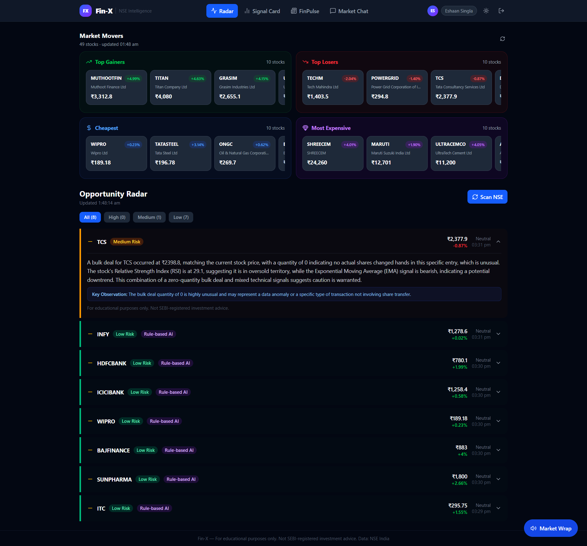
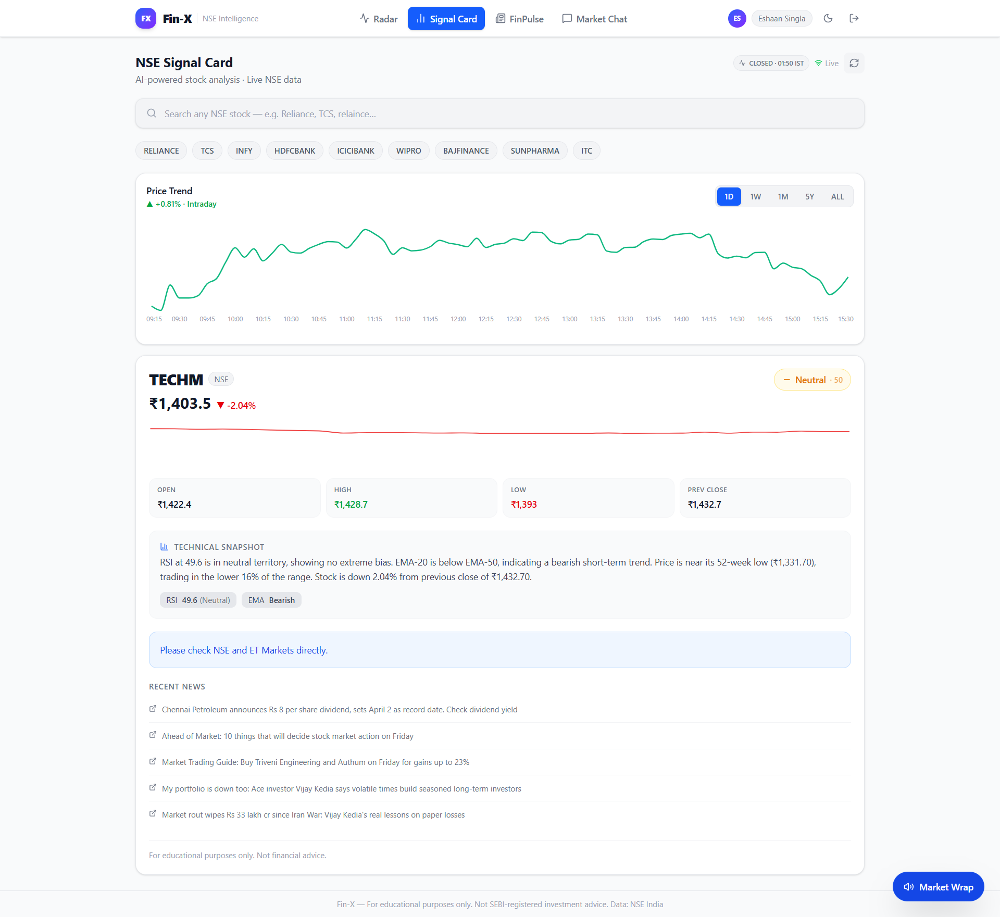
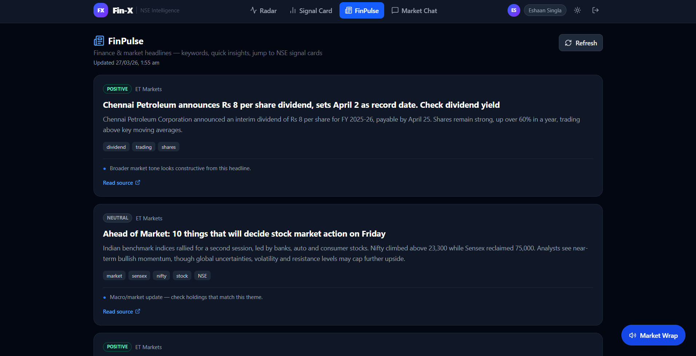
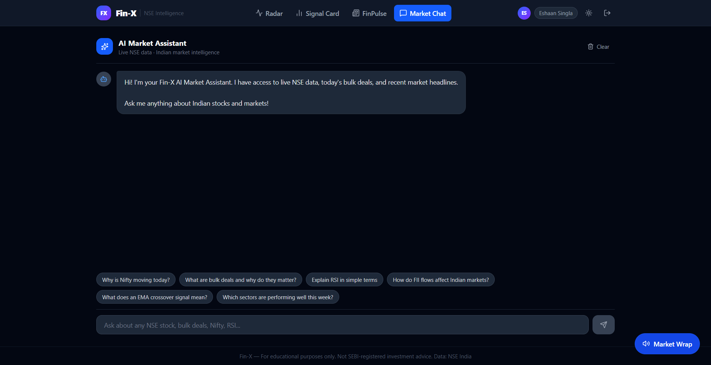

<div align="center">


<br/>

[](https://finx-pi.vercel.app)
[](https://fastapi.tiangolo.com)
[](https://react.dev)
[](https://python.org)

[](https://groq.com/)
[](https://openai.com)
[](https://jwt.io)
[](#-testing)
[](https://economictimes.indiatimes.com)

<br/>

<h2>
  <em>"90 million Indians have demat accounts.</em><br/>
  <em>Almost none can read what the smart money is actually doing."</em>
</h2>

<h3>FIN-X is the explanation layer.</h3>

<p>Real-time NSE institutional bulk &amp; block deal tracking — run through a 3-tier AI stack —<br/>
surfacing what it all <strong>means</strong>, in plain language, before the broader market reacts.</p>

<br/>

[**Live Demo**](https://finx-pi.vercel.app) · [**Screenshots**](#-screenshots) · [**Architecture**](#-architecture) · [**Quick Start**](#-quick-start) · [**API Docs**](#-api-reference) · [**Security**](#-security)

<br/>

</div>

---

## 📸 Screenshots

### Landing Page & Auth
> Production-grade dark UI with Google OAuth 2.0 and email/password login. Real stats: 500+ NSE stocks, 3-tier AI fallback, <50 ms price latency, live WebSocket feed.


---

### Opportunity Radar — Live NSE Signal Feed
> Real-time bulk & block deal scanner with AI-generated explanations, risk levels, and institutional pattern detection. Filterable by High / Medium / Low risk. Expandable signal cards with key observations and technical context.



---

### NSE Signal Card — Per-Stock Deep Analysis
> Live price chart across 6 timeframes (1D / 1W / 1M / 1Y / 5Y / ALL), full technicals (RSI, EMA-20/50, MACD, Bollinger Bands), AI sentiment score, news impact rating, institutional cluster detection. Two-phase load: price in <200 ms, full AI analysis seamlessly replaces it.




> Complete dark/light toggle across all pages. Same live data, two aesthetics.

---

### FinPulse Intelligence
> Finance news with AI sentiment classification (POSITIVE / NEUTRAL / NEGATIVE), keyword extraction, and direct NSE symbol mapping. News linked to affected stocks — not just headlines.



---

### AI Market Chat — Context-Injected, Never Hallucinated
> Every answer grounded in live NSE prices, today's bulk deals, Nifty 50 snapshot, and real-time news sentiment. Built-in prompt suggestions. No generic chatbot behaviour — real data on every query.



---

## 🧠 The Problem

Every day, institutions — mutual funds, FIIs, proprietary trading desks — move thousands of crores in NSE bulk and block deals. This data is technically public. But it's buried in raw CSVs, stripped of context, and gone before most retail investors even see it.

The result: **a two-tier market** where institutions act on signals retail investors can't decode.

**FIN-X closes that gap. Not with predictions — with *explanations*.**

| The old way | The FIN-X way |
|---|---|
| Raw NSE bulk deal CSV — no context | AI-explained signal with risk level and confidence score |
| Single AI model → single point of failure | 3-tier stack: Groq → GPT-4o mini → rules. **Zero downtime.** |
| Stock screeners that predict | Explanation-first: *why* it happened, not just *what* |
| Generic financial chatbots | Context-injected: live prices + deals + news in **every** answer |
| No auth or basic sessions | Production JWT + Google OAuth + bcrypt + rate limiting |
| Ship and hope | 22 passing pytest tests across 7 suites before prod |

---

## ✨ Features

<table>
<tr>
<td width="50%" valign="top">

### 🔭 Opportunity Radar
Real-time NSE bulk & block deal scanner. Detects institutional accumulation and distribution patterns with AI-generated signal explanations, risk levels (High / Medium / Low), and confidence scores. Refreshed hourly via APScheduler. Filterable. Expandable signal cards with key observations.

</td>
<td width="50%" valign="top">

### 📊 AI Signal Cards
Per-stock deep analysis on demand. Live price chart across 6 timeframes. Full technicals: EMA-20/50, RSI, MACD, Bollinger Bands. AI sentiment score, news impact rating, pattern success rate, institutional cluster detection, management tone shift analysis.

</td>
</tr>
<tr>
<td width="50%" valign="top">

### 💬 AI Market Chat
Ask anything about the Indian market. Every answer is grounded in live NSE prices, today's Nifty 50 snapshot, active radar signals, and real-time news sentiment — context-injected on every query. Prompt suggestions built in.

</td>
<td width="50%" valign="top">

### 📰 FinPulse Intelligence
Finance news with AI sentiment classification (POSITIVE / NEUTRAL / NEGATIVE), keyword extraction, and direct NSE symbol mapping to affected stocks. News is never just a headline.

</td>
</tr>
<tr>
<td width="50%" valign="top">

### 🔐 Production Auth System
Email + password with transactional verification email, Google OAuth 2.0, JWT access + refresh tokens with silent rotation, bcrypt 12-round hashing, per-IP rate limiting (10 req / 60 s), and 5 security headers on every response.

</td>
<td width="50%" valign="top">

### 🔍 Instant Smart Search
Debounced 7-step fuzzy NSE search across 100+ symbols with dropdown suggestions and keyboard navigation. Two-phase loading: live price appears in **<200 ms** from scheduler-warmed cache. Full AI card follows seamlessly. Re-visiting a stock within 5 min is instant — zero network calls.

</td>
</tr>
<tr>
<td width="50%" valign="top">

### 📡 Live Market Feed
Real-time price streaming per symbol via WebSocket. Market movers (gainers, losers, cheapest, most expensive) polled every **5 s** during market hours. IST open/closed awareness with adaptive polling rates across all components.

</td>
<td width="50%" valign="top">

### ⚡ Sub-Second Performance
Module-level card cache (5 min TTL) + live price cache (session) means revisiting any stock is instant. Popular stocks pre-warmed 800 ms after mount. Request deduplication prevents duplicate concurrent fetches. Backend L1 in-memory cache before DB read.

</td>
</tr>
</table>

---

## 🏗 Architecture

```
┌─────────────────────────────────────────────────────────────────────────┐
│                          FIN-X SYSTEM                                   │
├─────────────────────────────────────────────────────────────────────────┤
│                                                                         │
│   ┌─────────────────────  REACT 18 FRONTEND  ─────────────────────┐    │
│   │                                                                │    │
│   │  ┌───────────┐  ┌────────────┐  ┌──────────┐  ┌───────────┐  │    │
│   │  │  Radar    │  │  Signal    │  │  Chat    │  │ FinPulse  │  │    │
│   │  │  Page     │  │  Cards     │  │   AI     │  │   Page    │  │    │
│   │  └─────┬─────┘  └─────┬──────┘  └────┬─────┘  └─────┬─────┘  │    │
│   │        └──────────────┴──────────────┴───────────────┘        │    │
│   │          Axios · JWT Bearer · Silent Refresh Interceptor       │    │
│   │          AuthContext (tokens) · ThemeContext (dark/light)      │    │
│   │          _cardCache (5 min) · _liveCache (session)             │    │
│   └────────────────────────────┬───────────────────────────────────┘    │
│                                │ HTTPS / WSS                            │
│   ┌────────────────────────────┴──────────────────────────────────┐    │
│   │                      FASTAPI BACKEND                          │    │
│   │                                                               │    │
│   │  /api/v2/auth/*  ── JWT auth + Google OAuth 2.0              │    │
│   │  /api/signals    ── NSE Radar Engine                         │    │
│   │  /api/card/*     ── AI Signal Card Generator (parallel fetch) │    │
│   │  /api/chat       ── Grounded Market Chat                     │    │
│   │  /api/market/*   ── Live Prices + WebSocket + Movers         │    │
│   │  /api/finpulse   ── News Intelligence                        │    │
│   │  /api/search     ── Fuzzy NSE Symbol Search                  │    │
│   │                                                               │    │
│   │  ┌─────────────────── 3-TIER AI STACK ──────────────────┐    │    │
│   │  │                                                       │    │    │
│   │  │  Tier 1  Groq  Llama-3.3-70b-versatile  ← Primary   │    │    │
│   │  │               ↓  on quota / error                    │    │    │
│   │  │  Tier 2  OpenAI  GPT-4o mini             ← Fallback  │    │    │
│   │  │               ↓  on quota / error                    │    │    │
│   │  │  Tier 3  Rule Engine (RSI/EMA/price)     ← Always-on │    │    │
│   │  └───────────────────────────────────────────────────────┘    │    │
│   │                                                               │    │
│   │  APScheduler jobs (always running):                           │    │
│   │   • refresh_live_quotes()    every 10 s  (50 symbols, IST)   │    │
│   │   • refresh_movers_cache()   every  8 s                      │    │
│   │   • run_radar()              every  1 h                      │    │
│   │   • prefetch_popular_stocks  on startup                      │    │
│   │                                                               │    │
│   │  SQLite (dev) ──→ PostgreSQL (prod) via DATABASE_URL         │    │
│   │  L1 in-memory card cache (15 min) → L2 SQLite                │    │
│   └───────────────────────────────────────────────────────────────┘    │
│                                                                         │
└─────────────────────────────────────────────────────────────────────────┘
```

### Signal Data Flow

```
  NSE Bulk & Block Deals (raw CSV / HTML)
              │
              ▼
  ┌───────────────────┐     ┌──────────────────────┐     ┌─────────────────┐
  │   NSE Scraper     │────▶│    3-Tier AI Stack    │────▶│  Signal Store   │
  │  (hourly cron)    │     │  Groq → GPT-4o mini   │     │  SQLite / PG    │
  └───────────────────┘     │   → Rule fallback     │     └────────┬────────┘
                            └──────────────────────┘              │
                                                                   ▼
                                          ┌────────────────────────────────────┐
                                          │        API Response Layer          │
                                          │  • Signal explanation              │
                                          │  • Confidence score (0–100)        │
                                          │  • Risk level  (H / M / L)         │
                                          │  • Institutional cluster           │
                                          │  • Live technicals overlay         │
                                          │  • News sentiment                  │
                                          └─────────────────┬──────────────────┘
                                                            │
                               ┌────────────────────────────┼───────────────────────┐
                               ▼                            ▼                       ▼
                          React UI                     WebSocket               Chat Context
                          (Radar Page)                 (Live Feed)             (Grounded AI)
```

### Real-Time Price Architecture

```
  Scheduler (every 10 s, market hours only)
    └─→ refresh_live_quotes()
          ├─→ warms /market/price/{sym}  for all 50 tracked symbols
          └─→ warms /market/live/{sym}   intraday data

  CardPage — Two-Phase Load
    handleSelect(symbol)
      ├─→ Phase 1: fetchQuickPrice()   /market/price/{sym}   < 200 ms  (from warm cache)
      │     └─→ renders QuickPriceView immediately
      └─→ Phase 2: fetchSignalCard()  /card/{sym}            5–15 s    (AI generation)
            └─→ replaces QuickPriceView seamlessly (no flash)

  Live Poll (when card is open)
    ├─→ /market/live/{sym}  every  4 s  (market open)
    └─→ /market/live/{sym}  every 30 s  (market closed)
```

---

## 🔐 Auth Flow

```
  EMAIL SIGNUP                                GOOGLE OAUTH 2.0
  ────────────                                ────────────────

  POST /api/v2/auth/signup                    GET /api/v2/auth/google/login
    │  bcrypt hash (12 rounds)                  │  redirect → Google consent screen
    │  send verification email                  │
    ▼                                           ▼
  GET /api/v2/auth/verify-email?token=        GET /api/v2/auth/google/callback
    │  mark is_verified = true                  │  fetch email + name from Google
    │  redirect → frontend                      │  upsert user record
    ▼                                           ▼
  POST /api/v2/auth/login                     issue JWT pair
    │  validate credentials
    │  check is_verified flag
    ▼

           { access_token (60 min), refresh_token (14 days) }
                            │
                   stored in localStorage
                   Bearer header on all API requests
                            │
                   ┌────────┴─────────┐
                   │  401 detected    │
                   │  silent refresh  │  ← interceptor in api/index.js
                   │  rotate tokens   │  ← old token instantly invalidated
                   │  retry original  │  ← queued concurrent requests resume
                   └──────────────────┘
```

---

## ⚡ Performance

| Metric | Value |
|---|---|
| First price visible | **< 200 ms** (scheduler-warmed cache) |
| Revisiting a stock (5 min window) | **0 ms** (module-level cache, no network call) |
| Popular stock preload | **800 ms after mount** (background, parallel) |
| Market movers refresh | **every 5 s** (market hours) / 60 s (closed) |
| Live quote refresh | **every 4 s** (market hours) / 30 s (closed) |
| Scheduler warm cycle | **< 2 s** for all 50 symbols (10 parallel workers) |
| Backend L1 card cache | **sub-ms** for hot symbols (in-memory, 15 min TTL) |
| Signal card parallel fetch | **max(yfinance, NSE, news, intraday)** + AI — not sum |

---

## 🛠 Tech Stack

| Layer | Technology | Details |
|---|---|---|
| **Frontend** | React 18, Tailwind CSS, Vite, Recharts | SPA, code-split vendor bundles, dark/light theme |
| **Backend** | FastAPI, Uvicorn, APScheduler | Async API, hourly scheduling, WebSockets |
| **Database** | SQLite → PostgreSQL via SQLAlchemy | Auto-switch via `DATABASE_URL` — no code changes |
| **AI — Primary** | Groq Llama-3.3-70b-versatile | Market analysis, chat grounding, signal explanation |
| **AI — Fallback** | GPT-4o mini | Quota resilience, zero AI downtime |
| **AI — Hard fallback** | Custom rule engine (RSI / EMA / price) | Always-on, zero API dependency |
| **Auth** | JWT (python-jose), bcrypt, Google OAuth 2.0 | Authlib, silent token rotation, version-locking |
| **Email** | SMTP (Gmail App Passwords) | Transactional email verification |
| **Market Data** | NSE India scraper, yfinance | Live prices, bulk/block deals, intraday OHLCV |
| **Testing** | pytest, FastAPI TestClient, StaticPool | 22 tests across 7 suites, in-memory DB |
| **Deploy** | Render (backend) + Vercel (frontend) | `render.yaml` included, Vite env vars |

---

## 🚀 Quick Start

### Prerequisites
- Python 3.11+
- Node.js 18+

### 1. Clone

```bash
git clone https://github.com/eshaansingla/FIN-X.git
cd FIN-X
```

### 2. Backend

```bash
cd backend
python -m venv venv
venv\Scripts\activate          # Windows
# source venv/bin/activate     # macOS / Linux

pip install -r requirements.txt
cp .env.example .env
# edit .env — fill in API keys (see below)

uvicorn main:app --reload
# API  → http://localhost:8000
# Docs → http://localhost:8000/docs
```

**Minimum `.env` to get started:**

```env
# AI (get free key at console.groq.com)
GROQ_API_KEY=gsk_your_key_here

# Auth — generate with: python -c "import secrets; print(secrets.token_hex(32))"
JWT_SECRET_KEY=your-random-32-char-secret

# News (optional — RSS fallback used if missing)
NEWS_API_KEY=your-newsapi-key

# CORS
CORS_ORIGINS=http://localhost:5173
APP_URL=http://localhost:5173
BACKEND_URL=http://localhost:8000
```

### 3. Frontend

```bash
cd frontend
npm install
echo "VITE_API_URL=http://localhost:8000/api" > .env.local
npm run dev
# App → http://localhost:5173
```

---

## 📡 API Reference

### Auth — `/api/v2/auth`

| Method | Endpoint | Description |
|--------|----------|-------------|
| `POST` | `/signup` | Register — bcrypt hash + verification email |
| `GET` | `/verify-email?token=` | Activate account via email link |
| `POST` | `/login` | Credentials → access + refresh JWT pair |
| `POST` | `/refresh` | Rotate tokens — old token instantly invalidated |
| `GET` | `/me` | Current authenticated user |
| `GET` | `/google/login` | Start Google OAuth 2.0 flow |
| `GET` | `/google/callback` | OAuth callback — issues JWT pair |

### Market — `/api`

| Method | Endpoint | Description |
|--------|----------|-------------|
| `GET` | `/signals` | All active radar signals |
| `POST` | `/signals/refresh` | Force radar refresh |
| `GET` | `/card/{symbol}` | Full AI signal card (parallel fetch, 15 min cache) |
| `GET` | `/market/price/{symbol}` | Ultra-fast price + OHLCV — **<50 ms** from scheduler cache |
| `GET` | `/market/live/{symbol}` | Live NSE quote + intraday (parallel fetch) |
| `GET` | `/market/chart/{symbol}` | OHLCV chart data by period |
| `WS` | `/market/ws/{symbol}` | Real-time WebSocket price stream |
| `GET` | `/market/movers` | Top gainers, losers, cheapest, most expensive |
| `GET` | `/market/status` | Market open / closed + IST time |
| `POST` | `/chat` | Grounded market chat (live context injected) |
| `GET` | `/finpulse` | AI-augmented finance news |
| `GET` | `/search?q=` | Fuzzy NSE symbol search |
| `GET` | `/analytics/success-rate/{symbol}` | Pattern success statistics |
| `GET` | `/analytics/clusters` | Institutional cluster map |

> Full interactive Swagger UI at `/docs` · ReDoc at `/redoc`

---

## 🧪 Testing

```bash
cd backend
pytest tests/test_auth.py -v
# ✓ 22 passed in 6.97s
```

| Suite | What's covered |
|---|---|
| **Signup** | Valid signup, duplicate email, 4 weak password variants |
| **Login** | Unverified block, correct credentials, wrong password, unknown email, JWT format |
| **`/me` endpoint** | Authenticated, missing token, invalid token |
| **Token refresh** | Successful rotation, old token rejected, invalid token |
| **Email verification** | Invalid token redirect, valid token activation |
| **Rate limiting** | 429 response after 10 failed attempts per IP |
| **Security headers** | All 5 headers present on every response |

---

## 🛡 Security

| Feature | Implementation |
|---|---|
| Password hashing | bcrypt, 12 rounds |
| Token signing | HS256 JWT via python-jose |
| Refresh rotation | Version-locked — old tokens instantly invalidated on use |
| Rate limiting | Per-IP, 10 attempts / 60 seconds → `429 Too Many Requests` |
| Security headers | `X-Frame-Options`, `X-Content-Type-Options`, `X-XSS-Protection`, `Referrer-Policy`, `Permissions-Policy` |
| CORS | Explicit origin whitelist via `CORS_ORIGINS` env var — never `*` with credentials |
| Secrets | `.env` only — nothing hardcoded in source |
| Email verification | Account inactive until email confirmed — blocks fake signups |

---

## ☁️ Deployment

### Backend → Render

`render.yaml` included at `backend/render.yaml`. Set `rootDir` to `backend` in Render dashboard.

**Required env vars on Render:**

```
GROQ_API_KEY          your Groq key
JWT_SECRET_KEY        python -c "import secrets; print(secrets.token_hex(32))"
NEWS_API_KEY          your NewsAPI key
CORS_ORIGINS          https://your-frontend.vercel.app
APP_URL               https://your-frontend.vercel.app
BACKEND_URL           https://your-service.onrender.com
SMTP_USER             your-gmail@gmail.com
SMTP_PASS             your-16-char-app-password
```

### Frontend → Vercel

```
VITE_API_URL          https://your-service.onrender.com/api
```

---

## 📁 Project Structure

```
FIN-X/
├── backend/
│   ├── main.py                    app factory, middleware, router registration
│   ├── database.py                SQLite helper layer (v1 routes)
│   ├── scheduler.py               APScheduler — radar, live quotes, movers warm
│   ├── core/
│   │   ├── config.py              Pydantic settings (reads .env)
│   │   ├── db.py                  SQLAlchemy engine + session factory
│   │   └── security.py            bcrypt + JWT create/decode
│   ├── models/user.py             auth_users SQLAlchemy model
│   ├── schemas/auth.py            Pydantic request/response schemas
│   ├── routes/auth.py             /api/v2/auth/* endpoints
│   ├── routers/                   signals, cards, chat, market, finpulse, search
│   ├── services/
│   │   ├── gpt.py                 3-tier AI stack + rule engine
│   │   ├── nse_service.py         parallel NSE quote fetcher (10 workers)
│   │   ├── nse_fetcher.py         raw NSE HTTP client (retry + headers)
│   │   ├── market_hours.py        IST open/closed detection
│   │   ├── news_fetcher.py        NewsAPI + RSS fallback
│   │   ├── indicators.py          RSI, EMA, MACD, Bollinger Bands
│   │   ├── search_service.py      7-step fuzzy NSE symbol search
│   │   └── auth_service.py        user CRUD + email verification
│   ├── tests/test_auth.py         22 pytest tests
│   ├── prompts/                   AI prompt templates
│   ├── .env.example
│   ├── render.yaml
│   └── requirements.txt
└── frontend/
    ├── src/
    │   ├── App.jsx                loading guard + route switch
    │   ├── api/index.js           Axios client + silent token refresh + dedup
    │   ├── context/
    │   │   ├── AuthContext.jsx    tokens, session restore, Google callback
    │   │   └── ThemeContext.jsx   dark/light mode
    │   ├── components/
    │   │   ├── SearchBar.jsx      debounced fuzzy search + keyboard nav
    │   │   ├── MarketMovers.jsx   adaptive polling, 4 sections, LIVE badge
    │   │   ├── SignalCard.jsx     full technical + AI analysis card
    │   │   ├── ClusterRadar.jsx   institutional cluster radar chart
    │   │   └── TrendChart.jsx     Recharts OHLCV with no-animation live mode
    │   └── pages/
    │       ├── LandingPage.jsx    auth + hero
    │       ├── RadarPage.jsx      signal feed
    │       ├── CardPage.jsx       two-phase load, live poll, caches
    │       ├── ChatPage.jsx       context-injected AI chat
    │       └── FinPulsePage.jsx   news intelligence
    ├── vite.config.js             code-split: react / chart / http vendors
    └── package.json
```

---

<div align="center">

**Built for the Economic Times AI Fintech Hackathon — AI Fintech Track**

*Educational use only · Not SEBI-registered investment advice · Data sourced from NSE India*

<br/>


</div>
